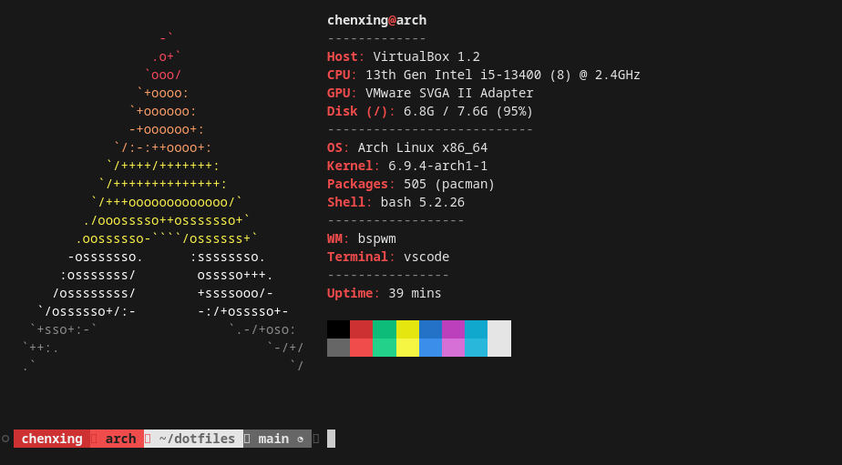

# 🗃️ dotfiles

This is a step-by-step guide on how to install and configure Arch Linux in 2025.

## Guides

### How to Install Arch Linux

> Written on April 9th, 2025

Download the Arch Linux ISO image on the [official website](https://archlinux.org/download/).

Create a bootable USE drive using [Rufus](https://rufus.ie/en/). [1]

Restart the system and enter the BIOS.


Select `Arch Linux install medium (x86_64, BIOS)` to boot the Arch Linux install medium on BIOS.


To connect to Wi-Fi, use the `iwctl` utility [2]

```bash
iwctl
```

With the `iwd` console, you can check the available devices in Station mode, get available networks, and connect to network

```bash
device list # List devices in station mode
station wlan0 get-networks # get networks for station wlan0
station wlan0 connect <"network name"> # connect to network
```

After you enter the correct Passphrase, the state of the device should now be `connected`. Ctrl-C to exit the `iwc` console. 

Before we install and run the `archinstall`, we should probably sync the packages

```bash
pacman -Syy
pacman -S archinstall
archinstall
```


-   Keep the Locales as it (us, en_US, UTF-8).
-   Mirrors and repositories:
    -   Set your Mirror Region to where you are.
    -   Optional repositories: multilib
-   Select `Use a best-effort default partition layout` for partitioning, and select the hard drive to use. Select `ext4` for filesystem.
-   Leave the Disk encryption as empty.
-   Bootloader to use: `Grub`
-   Set Root password
-   Add your user account (Remember you **password**!), and `yes`, it should be a superuser. Confirm and exit.
-   For Profile, set `type` to `Desktop`, and select `Awesome` as our desktop environment, and choose `ly` as the Greeter.
-  Choose `Pipewire` for audio server.
-  Netword configuration: `Use NetworkManager`
-  Set your timezone.

And we are good to go!

**INSTALL!**

Then, select `no` when asked whether to chroot into the installation.

**REBOOT** and `Boot existing OS` this time.

If you follow the instructions above, right now you should be greeted by the default `ly` display manager.


After you successfully logged in, this is what default Awesome looks like.


### Switch to Ly from other display managers

```bash
sudo pacman -S ly
rm /etc/systemd/system/display-manager.service
systemctl enable ly.service -- Enable the service
```

### Default Awesome Keybindings

| keybind       | description      |
| ------------- | ---------------- |
| Super+S       | show help        |
| Super+Shift+C | close window     |
| Super+Enter   | open a terminal  |
| Super+P       | show the menubar |
| Super+R       | run prompt       |
| Super+Ctrl+R | reload awesome   |

### Change the Awesome Default Config

Create the directory, copy and edit the template file:

```bash
mkdir -p ~/.config/awesome/
cp /etc/xdg/awesome/rc.lua ~/.config/awesome/
code ~/.config/awesome/
```

#### Change the default terminal to WezTerm

Install WezTerm

```bash
sudo pacman -S wezterm
```

```lua
-- ~/.config/awesome/rc.lua
terminal = "wezterm"
```

#### Change the Keybindings

```lua
-- ~/.config/awesome/rc.lua

```

### Set Wallpaper

-   Launch nitrogen
-   `Preferences` -> `Add` to add `dotfiles/wallpapers` to Directory. `OK`
-   Click on the wallpaper, `Scaled` and `Screen 1`, `OK`

Once you have successfully set your wallpaper, your desktop should look like what's down below


### How to Setup Chinese Input Method

> Written on June 14th, 2024

We are going to use `fcitx5` for our input method and `Noto Sans Mono CJK` for our font

```bash
sudo pacman -Sy fcitx5-im
sudo pacman -Sy fcitx5-chinese-addons
```

Set the IM modules environment variables and reboot

```bash
sudo nano /etc/environment
```

```text
GTK_IM_MODULE=fcitx
QT_IM_MODULE=fcitx
XMODIFIERS=@im=fcitx
```


`Win + D` to launch Rofi and run the _Fcitx 5 Configuration_.

On the right panel, search for input method `Pinyin` , double click on it to set it as Current Input Method.

Then go to the `Global Options` section, remove the `Enumerate Input Method Group Forward/Backward` keybinds and change the `Trigger Input Method` keybind from `Control+Space` to `Super+Space`.

Apply the changes and go back to the `Input Method` section. Select `Pinyin` and click on the `Configure` button.

-   Enable Cloud Pinyin
-   Configure Cloud Pinyin:
    -   Minimum Pinyin Length: 2
    -   Backend: Baidu
-   Previous Candidate: Left
-   Next Candidate: Right


One last step to set is to edit the locale file

```bash
sudo nano /etc/locale.gen
```

Uncomment lines:

```text
zh_CN.UTF-8 UTF-8
zh_HK.UTF-8 UTF-8
zh_TW.UTF-8 UTF-8
```

### Synth-Shell for Fancy Bash Prompt

> Written on June 15th, 2024

To install and setup `synth-shell`, simply run the `./install-synth-shell.sh` script

```bash
sh ./install-synth-shell.sh
```

### Neofetch/Hyfetch Configuration and Customization

> Written on June 15th, 2024



When you first run `hyfetch`, it will prompt you to configure. My setup is:

-   color: akiosexual
-   brightness: 50%
-   arrangement: horizontal

To run `Hyfetch`, the modern `Neofetch` every time you launch the terminal, simply add `hyfetch` to your `.bashrc` file

```bash
nano $HOME/.bashrc
```

```bash
hyfetch
```

To configure `neofetch`,

```bash
cp -r neofetch $HOME/.config
```

### VSCode Setup

> Written on June 15th, 2024

Extensions to install:

-   Prettier - Code formatter

To configure `Code - OSS`,

```bashs
cp Code\ -\ OSS/User/settings.json $HOME/.config/Code\ -\ OSS/User
cp Code\ -\ OSS/User/keybindings.json $HOME/.config/Code\ -\ OSS/User
```

### SDDM Login Manager

> Written on June 15th, 2024

Install the modified version of `Where is my SDDM theme?`

```bash
sh ./install-sddm-theme.sh
```

### Setup and Configure Rofi

> Written on June 15th, 2024

To configure `Rofi`,

```bash
cp -r rofi $HOME/.config
```

### Set up Slock

> Written on June 15th, 2024

To install and configure `slock`

```bash
sh ./install-slock.sh
```

### Scrot and Dunst Notifications

> Written on June 15th, 2024

I store my screenshots in `$HOME/Pictures/screenshot`

```bash
mkdir $HOME/Pictures
mkdir $HOME/Pictures/screenshot
```

To install `scrot`, the screenshot software

```bash
sudo pacman -S scrot
```

To take a screenshot, simply press the `PrtSc` key

### URxvt Configuration

> Written on June 15th, 2024

To configure `urxvt`

```bash
cp urxvt/.Xdefaults $HOME
```

[1] Upgrading an Old ThinkPad With Linux. *Mental Outlaw*.
[2] Linux Tips - Install Full Arch on a USE Drive (2023). *AgileDevArt*.