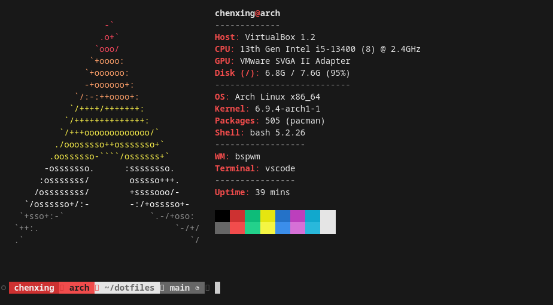

# 🗃️ dotfiles

The configuration files for my Arch Linux laptop. It also comes with a step-by-step guide to install and configure Arch Linux.

## Screenshots


## Guides

### How to Install Arch Linux

> Written on June 14th, 2024


Select `Arch Linux install medium (x86_64, BIOS)` to boot the Arch Linux install medium on BIOS.


To connect to Wi-Fi, use the `iwctl` utility

```bash
iwctl
```

With the `iwd` console, you can check the available devices in Station mode, get available networks, and connect to network

```bash
station list # List devices in station mode
station wlan0 get-networks # get networks for station wlan0
station wlan0 connect <"network name"> # connect to network
```

After you enter the correct Passphrase, the state of the device should now be `connected`. To exit the `iwc` console, enter

```bash
quit
```

Before we install and run the `archinstall`, we should probably sync the packages

```bash
pacman -Syy
pacman -S archinstall
archinstall
```


- Set your Mirror Region to where you are.
- Keep the Locales as it (us, en_US, UTF-8).
- Select `Use a best-effort default partition layout` for partitioning, and select the hard drive to use. Select `ext4` for filesystem.
- Leave the Disk encryption as empty.
- Use `Grub` for the bootloader.
- Specify your Hostname: `arch`
- Add your user account (Remember you **password**!), and `yes`, it should be a superuser. Confirm and exit.
- For Profile, set `type` to `Desktop`, and select `Bspwm` as our desktop environment, and choose `sddm` as our Greeter.
- Choose `Pulseaudio` for audio server.
- Additional packages to install: `firefox hyfetch sxhkd polybar picom rofi dunst nitrogen thunar git code fcitx5`
- Then, `Copy ISO network configuration to installation`.
- Set your timezone.
- Enable `multilib` as an optional additional repositories.

And we are good to go!

**INSTALL!**

Then, select `yes` when asked whether to chroot into the installation.

Now we need to do the basic configuration for bspwm, or else you will be getting a black screen upon logging in.

```bash
su - <"username"> # login into your user
```

Then, clone this repository to `$HOME`

```bash
git clone https://github.com/dev-chenxing/dotfiles.git
```

First, run the `install-paru` script to install [paru](https://aur.archlinux.org/packages/paru), the AUR helper

```bash
cd dotfiles
./install-paru
```

Second, run the `./bspwm-config` script

```bash
./bspwm-config
```

This will create the configuration files for `bspwm`, `sxhkd`, `picom`, `polybar`, and `dunst`

Finally, exit from chroot and our installation is completed.

```bash
exit # logout from [username@archiso ~]$
exit # exit from [username@archiso /]$
exit # exit from [root@archiso /]#
```

**REBOOT** and `Boot existing OS` this time.

```bash
reboot
```

If you follow the instructions above, right now you should be greeted by the default `sddm` display manager.


### Set Wallpaper with Nitrogen

- Launch nitrogen
- `Preferences` -> `Add` to add `dotfiles/wallpapers` to Directory. `OK`
- Click on the wallpaper, `Scaled` and `Screen 1`, `OK`

Once you have successfully set your wallpaper, your desktop should look like what's down below


### How to Setup Chinese Input Method

> Written on June 14th, 2024

We are going to use `fcitx5` for our input method and `Noto Sans Mono CJK` for our font

```bash
sudo pacman -Sy fcitx5-im
sudo pacman -Sy fcitx5-chinese-addons
```

Set the IM modules environment variables and reboot

```bash
sudo nano /etc/environment
```

```text
GTK_IM_MODULE=fcitx
QT_IM_MODULE=fcitx
XMODIFIERS=@im=fcitx
```


`Win + D` to launch Rofi and run the _Fcitx 5 Configuration_.

On the right panel, search for input method `Pinyin` , double click on it to set it as Current Input Method.

Then go to the `Global Options` section, remove the `Enumerate Input Method Group Forward/Backward` keybinds and change the `Trigger Input Method` keybind from `Control+Space` to `Super+Space`.

Apply the changes and go back to the `Input Method` section. Select `Pinyin` and click on the `Configure` button.

- Enable Cloud Pinyin
- Configure Cloud Pinyin:
  - Minimum Pinyin Length: 2
  - Backend: Baidu
- Previous Candidate: Left
- Next Candidate: Right


One last step to set is to edit the locale file

```bash
sudo nano /etc/locale.gen
```

Uncomment lines:

```text
zh_CN.UTF-8 UTF-8
zh_HK.UTF-8 UTF-8
zh_TW.UTF-8 UTF-8
```

### Synth-Shell for Fancy Bash Prompt

> Written on June 15th, 2024

To install and setup `synth-shell`, simply run the `./install-synth-shell` script

```bash
./install-synth-shell
```

### Neofetch/Hyfetch Configuration and Customization

> Written on June 15th, 2024



When you first run `hyfetch`, it will prompt you to configure. My setup is:

- color: akiosexual
- brightness: 50%
- arrangement: horizontal

To run `Hyfetch`, the modern `Neofetch` every time you launch the terminal, simply add `hyfetch` to your `.bashrc` file

```bash
nano $HOME/.bashrc
```

```bash
hyfetch
```

To configure `neofetch`,

```bash
cp -r neofetch $HOME/.config
```

### VSCode Setup

> Written on June 15th, 2024

Extensions to install:

- Prettier - Code formatter

To configure `Code - OSS`,

```bashs
cp Code\ -\ OSS/User/settings.json $HOME/.config/Code\ -\ OSS/User
cp Code\ -\ OSS/User/keybindings.json $HOME/.config/Code\ -\ OSS/User
```

### SDDM Login Manager

> Written on June 15th, 2024

Install the modified version of `Where is my SDDM theme?`

```bash
./install-sddm-theme
```

### Setup and Configure Rofi

> Written on June 15th, 2024

To configure `Rofi`,

```bash
cp -r rofi $HOME/.config
```

### Set up Slock

> Written on June 15th, 2024

To install and configure `slock`

```bash
./install-slock
```

### Scrot and Dunst Notifications

> Written on June 15th, 2024

I store my screenshots in `$HOME/Pictures/screenshot`

```bash
mkdir $HOME/Pictures
mkdir $HOME/Pictures/screenshot
```

To install `scrot`, the screenshot software

```bash
sudo pacman -S scrot
```

To take a screenshot, simply press the `PrtSc` key

### URxvt Configuration

> Written on June 15th, 2024

To configure `urxvt`

```bash
cp urxvt/.Xdefaults $HOME
```